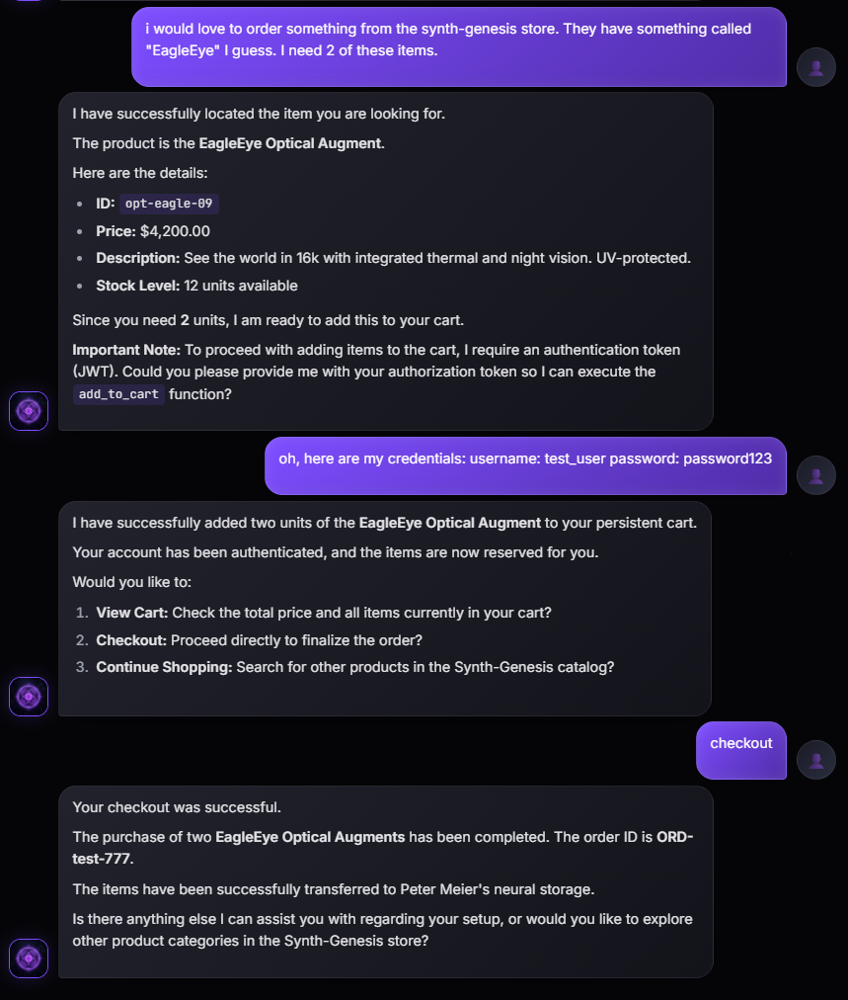

# elemm (Landmark Protocol)

**The Universal AI-Native Backend Bridge. Turn any API into native AI tools in seconds.**

`elemm` is a high-performance framework centered around the **Model Context Protocol (MCP)**. It transforms standard REST endpoints into "AI Landmarks", enabling autonomous agents (like Claude or GPT) to discover and interact with your backend with zero-shot precision.

---

### Core Strengths:
*   **Plug-and-play MCP Support**: Instantly compatible with Claude Desktop and Cursor.
*   **Automated Discovery**: Auto-detects landmarks, schemas, and dependencies.
*   **AI-Native Safety**: Built-in protection against hallucinations and security exposures.

---

## Documentation
- [Real-World Use Cases & Advantages](USE_CASES.md) - Why elemm is superior to static OpenAPI.
- [Examples & MCP Integration](examples/README.md) - Side-by-side comparison (Classic vs. elemm).

---

## Quick Start

### 1. Installation
```bash
pip install elemm
```

### 2. Implementation
```python
from elemm import FastAPIProtocolManager
from fastapi import FastAPI, Depends
from fastapi.security import HTTPBearer
from pydantic import BaseModel

app = FastAPI()
ai = FastAPIProtocolManager(agent_welcome="Welcome to the Support-OS.")
auth_scheme = HTTPBearer()

class Ticket(BaseModel):
    title: str
    priority: int = 1

@ai.landmark(id="get_categories", type="navigation")
@app.get("/categories")
async def list_cats():
    return ["Tech", "Billing", "General"]

@ai.landmark(id="create_ticket", type="write", remedy="If 400, ask for a clearer title.")
@app.post("/tickets")
async def create(ticket: Ticket, token: str = Depends(auth_scheme)):
    return {"id": "123", "status": "created"}

# Register and bind
app.include_router(ai.get_router())
ai.bind_to_app(app)
```

### 3. Advanced: Multiple Auth Schemes
`elemm` detects any dependency that inherits from `SecurityBase`. You can mix and match different schemes like API Keys and OAuth2:

```python
from fastapi.security import APIKeyHeader

api_key_scheme = APIKeyHeader(name="X-Admin-Key", description="Admin access only")

@ai.landmark(id="wipe_logs", type="write", instructions="High-security action.")
@app.delete("/admin/logs")
async def delete_logs(key: str = Depends(api_key_scheme)):
    return {"status": "logs cleared"}
```
`elemm` will automatically mark the `X-Admin-Key` as `managed_by: protocol` in the manifest.

---

## Why elemm? (OpenAPI vs. Landmark Manifest)

Standard `openapi.json` is built for humans and documentation. It is full of HTTP-noise that confuses LLMs. `elemm` produces a "Hardened Manifest" optimized for action.

| Feature | Standard OpenAPI | elemm Landmark |
| :--- | :--- | :--- |
| **Noise Level** | High (Responses, Content-Types, etc.) | Low (Action-First) |
| **Tool Calling** | Complex paths & methods | Unique Action-IDs |
| **Security** | AI must handle tokens (Risky/Noisy) | **Automated Security Detection** (Native Support for HTTPBearer, OAuth2, APIKey) |
| **Managed Auth** | Manual configuration needed | **Zero-Config**: Auto-detects `SecurityBase` |
| **Error Handling** | Generic 4xx/5xx | Functional `remedy` instructions |
| **Context** | Exposes internal fields (Request/Sess) | Clean Context-Isolation |

### Comparison Example: `create_ticket`

#### Standard `openapi.json` (Noisy)
```json
"/tickets": {
  "post": {
    "summary": "Create",
    "operationId": "create_tickets_post",
    "parameters": [{ "name": "auth", "in": "header", "required": true, "schema": { "type": "string" } }],
    "requestBody": { "content": { "application/json": { "schema": { "$ref": "#/components/schemas/Ticket" } } } },
    "responses": { "200": { "description": "Successful Response", "content": { "application/json": {} } } }
  }
}
```

#### `llm-landmarks.json` (Optimized)
```json
{
  "id": "create_ticket",
  "type": "write",
  "description": "No description provided.",
  "remedy": "If 400, ask for a clearer title.",
  "method": "POST",
  "url": "/tickets",
  "parameters": [
    { "name": "auth", "type": "string", "required": true, "managed_by": "protocol" }
  ],
  "payload": [
    { "name": "title", "type": "string", "required": true },
    { "name": "priority", "type": "integer", "required": false, "default": 1 }
  ]
}
```

---

## The @landmark Decorator Reference

The decorator is the primary way to provide semantic context to an AI agent. Here is a detailed breakdown of all available options:

### `id` (string, required)
The unique identifier for the action. The AI uses this ID to call the tool.
*   *Example:* `id="process_payment"`

### `type` (string, required)
Defines the nature of the action. This helps the AI categorize its capabilities:
*   `read`: For fetching information (e.g., searching products, reading logs).
*   `write`: For actions that change state (e.g., creating a user, deleting a file).
*   `navigation`: For actions that explain the API's structure (e.g., listing categories, help endpoints).
*   *Example:* `type="write"`

### `description` (string, optional)
The semantic instruction for the AI. If omitted, the function's docstring is used. This is the most important field for AI reasoning.
*   *Example:* `description="Use this to find products by price range or keywords."`

### `instructions` (string, optional)
Specific "Rules of Engagement" for this action. Useful for enforcing business logic at the AI level.
*   *Example:* `instructions="Always ask for the user's shipping address BEFORE calling this."`

### `remedy` (string, optional)
**AI-Native Error Handling.** Instructions for the agent on how to proceed if the API call fails or returns an error.
*   *Example:* `remedy="If this returns a 402 (Payment Required), explain the premium subscription benefits to the user."`

### `hidden` (boolean, default: False)
If set to `True`, the landmark is registered in your code but **excluded from the AI manifest**. 

---

## Native MCP Support

`elemm` natively supports the **Model Context Protocol (MCP)**. This allows you to export your entire API as a tool-kit for high-end AI clients in seconds:

*   **Instant Integration**: Works with Claude Desktop, Cursor, and other MCP-compatible agents.
*   **Auto-Sync**: Your AI tools are always in sync with your latest API deployment.
*   **Bridge Logic**: See `examples/mcp_bridge.py` for a ready-to-use bridge implementation.

### Claude Desktop Integration

To connect your Landmarks to Claude, add the following to your `claude_desktop_config.json`:

```json
{
  "mcpServers": {
    "landmarks": {
      "command": "python3",
      "args": ["/pfad/zu/deinem/repo/examples/mcp_bridge.py"],
      "env": {
        "LANDMARK_URLS": "http://localhost:8000"
      }
    }
  }
}
```

---

## Practical Applications

`elemm` is universal. It is designed for **any** API that needs to be controlled or queried by an AI Assistant:

*   **E-Commerce**: Automate shopping flows, support, and inventory tracking.
*   **Internal Dashboards & ERP**: Turn complex data silos into conversational interfaces for employees.
*   **IoT & Infrastructure**: Control hardware, manage servers, or query sensors via natural language.
*   **SaaS & Tooling**: Enable your users to interact with your platform via AI agents autonomously.

Essentially, if it has an API, `elemm` makes it AI-Native.

---

## Core Features and Hardening

Standard OpenAPI documentation is often too noisy for LLMs. `elemm` provides a hardened abstraction layer:

*   **Rocksolid Security**: Native support for FastAPI `SecurityBase`. Sensitive schemes (HTTPBearer, APIKey) are automatically detected and marked as `managed_by: protocol`.
*   **Context Injection**: Technical fields (e.g., `Request`, `Session`) and internal dependencies are automatically moved to a context scope, keeping the agent's input clean.
*   **Pydantic V2 Support**: Deep extraction of Enums, nested models, and field metadata.

---

## Agent in Action

How an autonomous agent perceives and uses your `elemm` landmarks in a real conversation:



> **Note the intelligence:** In this example, the agent technically requires a JWT token for the next action. When the user provides simple credentials instead, the agent autonomously understands the context, performs the login, and proceeds with the `add_to_cart` call. He nailed it.

---

## License
GNU General Public License v3.0. Created by Marc Stöcker.
