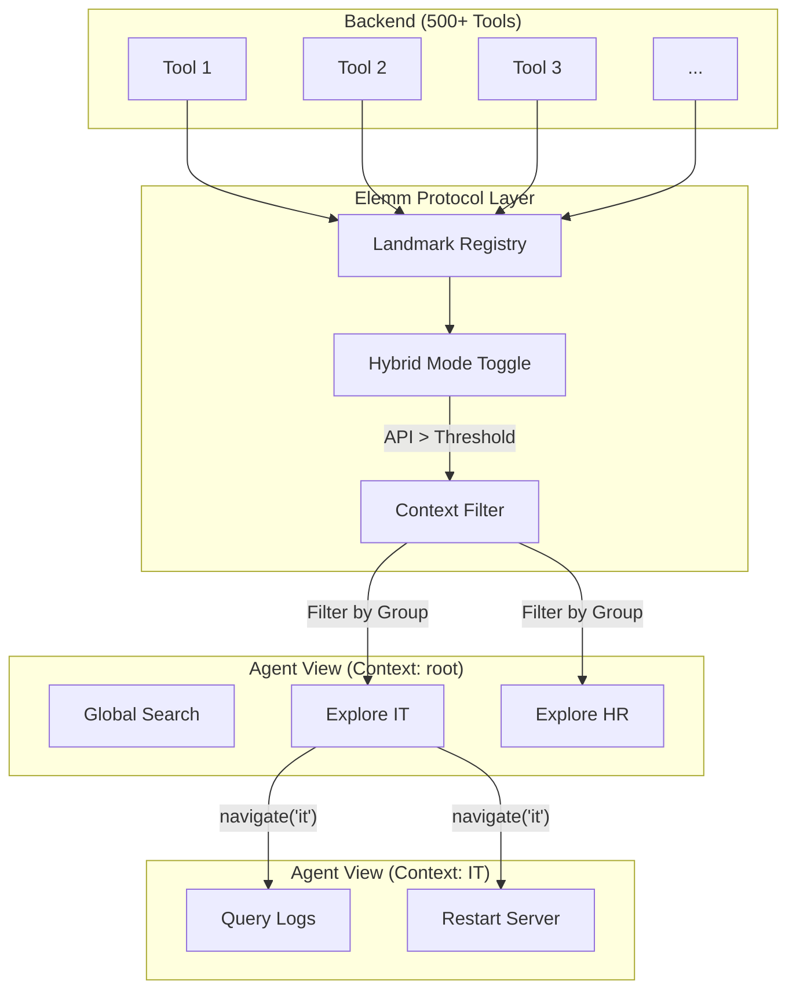

# Elemm Architecture: Hierarchical Navigation and Scalability

Elemm transforms a flat API structure into a navigable world of landmarks. This allows AI agents to access extremely large toolsets without overloading the context window.

## 1. Discovery Lifecycle

The following diagram illustrates how Elemm filters a massive backend into a manageable context for the agent:

## 2. Automated Navigation (Signposts)

A core feature of Elemm is the automatic generation of navigation points.

### Technical Distinction: Tool vs. ID
It is important to distinguish between the **Core Tools** used by the agent and the **Native Tools** discovered within landmarks:
- **get_manifest**: This is the primary discovery tool. It returns a Markdown manifest containing the available landmarks (navigation points) and a list of global tools.
- **navigate**: Used to move between modules. When calling `navigate`, the agent provides a `landmark_id`.
- **Native Tools**: Once an agent has navigated to a landmark (e.g. `it_ops`), all tools belonging to that group are exposed directly to the agent's toolbelt. The agent can call them **natively** (e.g. `query_logs()`) instead of using a generic executor.
- **execute_action**: A protocol-level fallback tool used to run any registered action by its ID.
- **explore_{tag_id}**: This is the default technical **ID** of a navigation landmark generated from FastAPI tags (e.g., `explore_it`).

### How it works
Elemm analyzes the `openapi_tags` of a FastAPI application. If a route has a tag defined in the metadata, Elemm automatically generates a navigation landmark.
- **ID Generation**: Groups automatically receive the prefix `explore_{tag_id}`.
- **Sanitization**: Special characters are cleaned (e.g., `User & Admin` becomes `explore_user_and_admin`).

## 3. Hybrid Mode (Auto-Flattening)

Elemm adapts to the size of the API.
- **Flat View**: If an API has fewer than the `hybrid_threshold` (default: 10) landmarks and no explicit group structure, Elemm removes the filtering.
- **Hierarchical View**: As soon as the API grows or groups are defined, it switches to structured mode.
- **Configuration**: The threshold can be adjusted during initialization: `Elemm(..., hybrid_threshold=5)`.

## 4. Versioning and Deprecation

In enterprise environments, Landmark IDs must remain stable. If you need to change a structure:

### Recommendations:
1. **Stability**: Prefer generic Landmark IDs (e.g., `explore_it_ops` instead of `explore_it_v1`).
2. **Deprecation**: If a landmark is deprecated, do not remove it immediately. Use the `hidden=True` attribute and provide a `remedy` explaining the new path.
3. **Redirection**: You can create a "legacy" landmark that simply returns a message: "This module has moved to 'explore_new_module'. Please navigate there."

## 5. Token Hygiene

The hierarchical structure drastically reduces token consumption.
- **Global Access**: Tools with `global_access=True` are visible everywhere. Use sparingly to avoid context noise.
- **Efficiency**: In practice, the tool catalog size per step is reduced by a factor of 10 to 50.
## 6. The Zero-Prompt Vision: Self-Documenting Infrastructure

A core design goal of Elemm is to eliminate the need for long, complex system prompts that explain API structures to the agent.

- **Embedded Persona**: By injecting the `agent_welcome` message into the primary navigation tools, the agent "discovers" its role and instructions through tool metadata rather than a static system prompt.
- **On-Demand Guidance**: Instructions (via the Agent Repair Kit) are delivered just-in-time when an error occurs, keeping the context window clean during successful operations.
- **Protocol-First Discovery**: The agent learns the API hierarchy at runtime by using `list_navigation_points`. This makes Elemm-based agents highly portable across different backend systems without requiring a single line of prompt engineering for the specific API layout.
