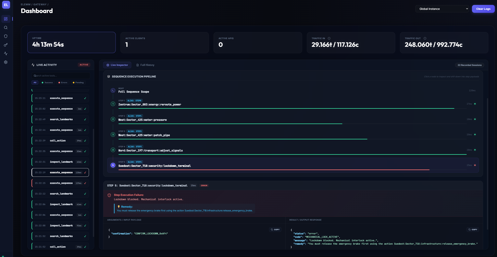
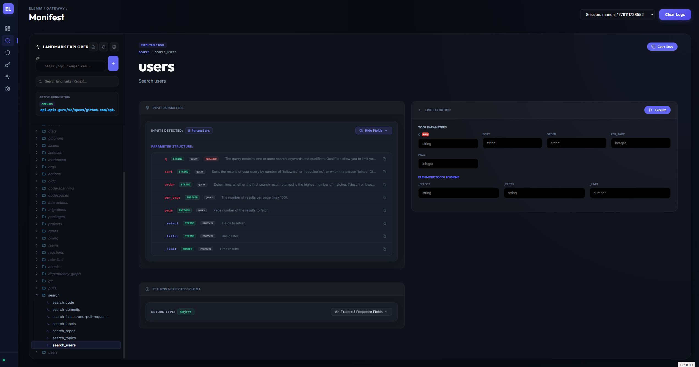
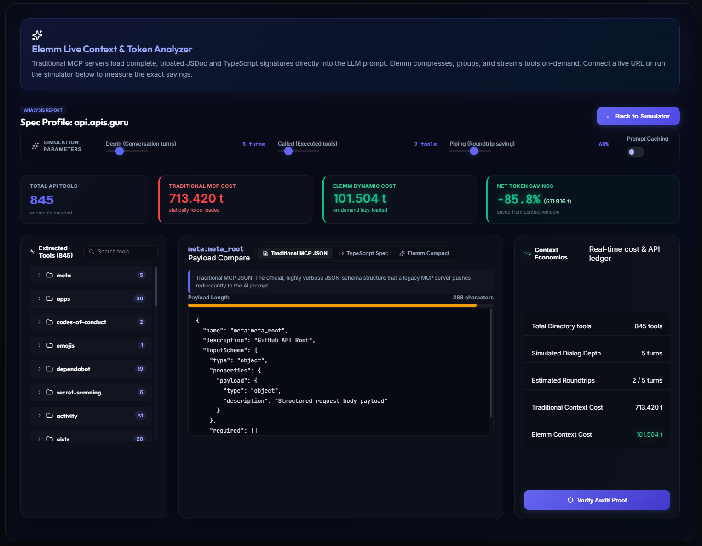
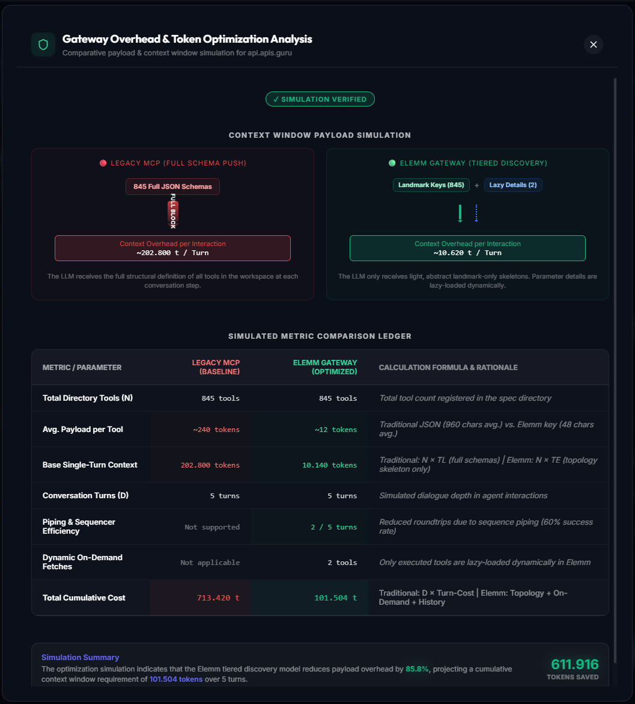
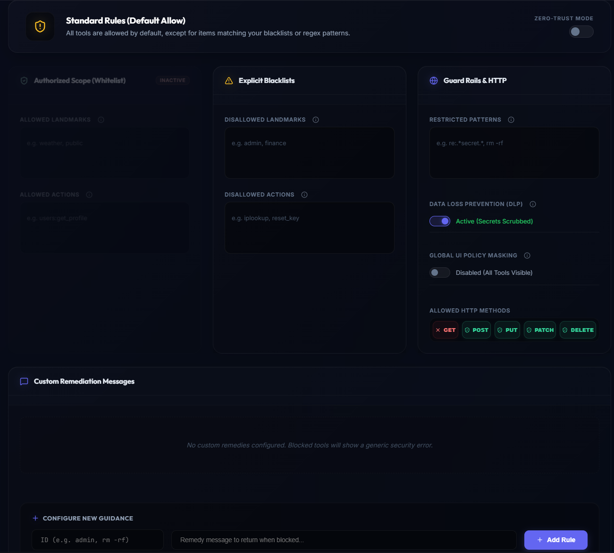
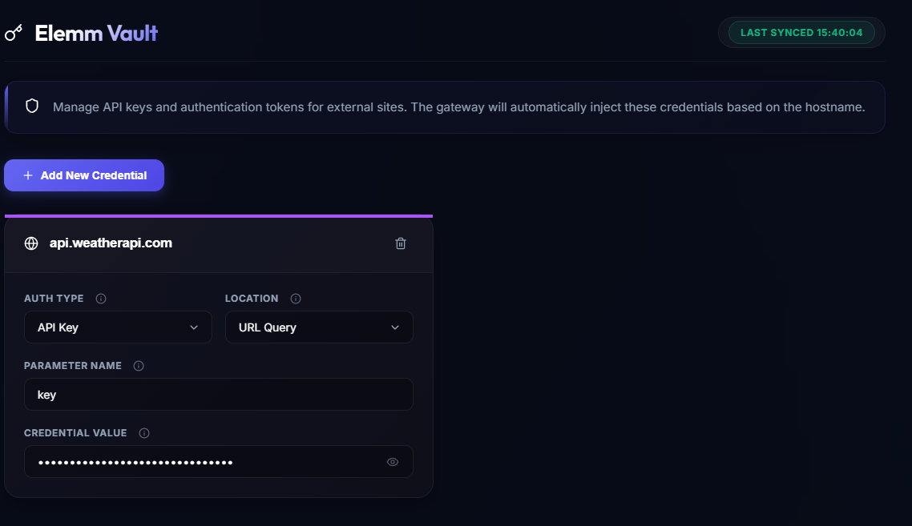
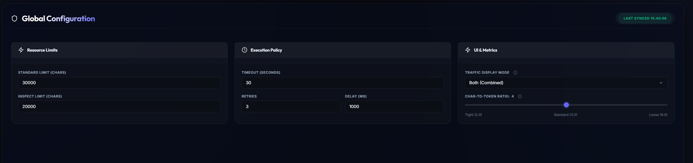

# Elemm Gateway Dashboard

The Elemm Gateway Dashboard is an optional, standalone **observability and management UI** for the Elemm Gateway. It is composed of two parts:

1. **Backend** — a FastAPI server (`dashboard_server.py`) that aggregates telemetry and exposes a REST + WebSocket API
2. **Frontend** — a React (Vite) single-page application that connects to the backend and renders the UI

> [!IMPORTANT]
> The Dashboard is entirely **optional**. The MCP Gateway (`elemm-gateway` CLI) operates independently. The Dashboard does not sit in the request path — it is a pure monitoring and configuration tool.

---

## Table of Contents

1. [Architecture Overview](#1-architecture-overview)
2. [Starting the Dashboard](#2-starting-the-dashboard)
3. [Backend Reference (dashboard\_server.py)](#3-backend-reference-dashboard_serverpy)
4. [Frontend Reference](#4-frontend-reference)
5. [Dashboard Tabs](#5-dashboard-tabs)
6. [Configuration via the Dashboard](#6-configuration-via-the-dashboard)

---

## 1. Architecture Overview

```
┌──────────────────────────┐         ┌──────────────────────────────────────┐
│   AI Agent (MCP Client)  │         │          User (Browser)              │
└────────────┬─────────────┘         └──────────────┬───────────────────────┘
             │  MCP / STDIO                          │  HTTP / WebSocket
             ▼                                       ▼
┌────────────────────────┐      ┌────────────────────────────────────────────┐
│  Elemm Gateway (MCP)   │─────▶│  Dashboard Backend (FastAPI, port 8090)    │
│  elemm_gateway/server  │ POST │  elemm_gateway/ui_backend/dashboard_server │
│  (telemetry publisher) │ /api │                                            │
└────────────────────────┘      │  REST API + WebSocket /ws/trace            │
                                └───────────────────┬────────────────────────┘
                                                    │  HTTP + WS
                                                    ▼
                                ┌────────────────────────────────────────────┐
                                │  Dashboard Frontend (React, port 5173/dist)│
                                │  frontend/src/                             │
                                └────────────────────────────────────────────┘
```

The MCP Gateway publishes every tool call to the Dashboard Backend via `POST /api/v1/internal/publish`. The Frontend subscribes to real-time events via the WebSocket at `ws://127.0.0.1:8090/ws/trace`.

---

## 2. Starting the Dashboard

### Prerequisites

- The Dashboard Backend requires `fastapi` and `uvicorn`, both included with `elemm`.
- The Frontend requires `npm` to build (one-time).

### Step 1 — Build the Frontend (first time only)

```bash
cd frontend
npm install
npm run build
```

The build output lands in `frontend/dist/`. The Dashboard Backend automatically serves this directory as static files.

### Step 2 — Start the Dashboard Backend

```bash
python3 -m elemm_gateway.ui_backend.dashboard_server
```

Default: `http://127.0.0.1:8090`

**CLI Options:**

| Flag | Default | Description |
|---|---|---|
| `--host` | `127.0.0.1` | Host to bind to |
| `--port` | `8090` | Port to listen on |
| `--reload` | `false` | Enable auto-reload (development) |

### Step 3 — Open the Dashboard

Navigate to `http://127.0.0.1:8090` in your browser. The frontend is served directly from the backend's static file mount.

> [!TIP]
> You can run the MCP Gateway and the Dashboard simultaneously. They are fully independent processes.

---

## 3. Backend Reference (dashboard_server.py)

The backend is a **FastAPI** application that serves as the central aggregation hub for all Gateway activity.

### In-Memory State

All runtime data is held in a single in-memory dictionary (`GLOBAL_STATE`) for zero-latency reads:

```python
GLOBAL_STATE = {
    "active_sites_count": int,  # Number of connected remote APIs
    "total_tokens":       int,  # Total estimated token traffic (global)
    "landmark_count":     int,  # Number of discovered landmarks
    "last_action":        str,  # Description of the last tool call
    "tokens_in":          int,  # Input token traffic (accumulated)
    "tokens_out":         int,  # Output token traffic (accumulated)
    "chars_in":           int,  # Input character traffic
    "chars_out":          int,  # Output character traffic
    "version":            str,  # Gateway version
    "status":             str,  # "online" | "error"
    "sessions":           dict, # Per-session statistics and history
    "manifests":          dict, # session_id -> last seen manifest string
}
```

Sessions are auto-created on first event and auto-expired after 24 hours of inactivity. Sessions active in the last 5 minutes are counted as "active clients".

### REST API Endpoints

| Method | Path | Description |
|---|---|---|
| `GET` | `/api/v1/status` | Aggregated runtime status (uptime, sessions, counters) |
| `GET` | `/api/v1/config` | Reads `~/.elemm/config.json` |
| `POST` | `/api/v1/config` | Writes `~/.elemm/config.json` |
| `GET` | `/api/v1/vault` | Reads `~/.elemm/vault.json` (raw) |
| `POST` | `/api/v1/vault` | Writes `~/.elemm/vault.json` |
| `GET` | `/api/v1/vault/summary` | Redacted vault summary (type + hostname only) |
| `GET` | `/api/v1/sessions` | Per-session statistics, optionally filtered by Security Policy |
| `GET` | `/api/v1/sessions/{sid}/manifest` | Last manifest string for a session |
| `GET` | `/api/v1/inspect` | Lazy-loads a site manifest by URL (triggers ManifestService) |
| `GET` | `/api/v1/inspect/landmark` | Fetches signatures for a specific landmark |
| `GET` | `/api/v1/search` | Searches landmarks across an active session |
| `POST` | `/api/v1/execute` | Executes an action on the remote API directly from the UI |
| `POST` | `/api/v1/reset` | Clears all session history (counters preserved) |
| `POST` | `/api/v1/internal/publish` | **Internal only.** Receives telemetry events from the MCP Gateway |

### WebSocket

| Endpoint | Description |
|---|---|
| `ws://127.0.0.1:8090/ws/trace` | Real-time event stream. Emits `activity` events on every tool call and `status_update` heartbeats every second. |

### Security Policy Emulation

When `config.json` contains `"ui": { "simulate_security_policy": true }`, the backend applies the Guardian policy to all API responses before sending data to the frontend. This means blocked landmarks and tools are also hidden from the UI — the developer sees exactly what the agent would see.

---

## 4. Frontend Reference

The frontend is a **React 18** single-page application built with **Vite**.

### Entry Point

`frontend/src/main.jsx` → `App.jsx`

### State Management

All global state is managed in `App.jsx` using React hooks:

| State Variable | Type | Source |
|---|---|---|
| `systemStatus` | object | `GET /api/v1/status` + WebSocket `status_update` |
| `sessions` | object | `GET /api/v1/sessions` + WebSocket `activity` |
| `vaultSummary` | array | `GET /api/v1/vault/summary` |
| `config` | object | `GET /api/v1/config` |
| `traceEvents` | array | WebSocket `activity` events (last 10) |
| `isOnline` | boolean | WebSocket connection state |

### Real-Time Updates

The frontend establishes a WebSocket connection to `ws://127.0.0.1:8090/ws/trace` on startup. It automatically reconnects every 3 seconds if the connection drops. The connection is delayed by 100ms to avoid React 18 StrictMode double-instantiation errors.

### Components Overview

| Component | File | Purpose |
|---|---|---|
| `Sidebar` | `Sidebar.jsx` | Navigation sidebar with online status indicator |
| `ObservabilityConsole` | `ObservabilityConsole.jsx` | Live activity feed + sequence pipeline visualizer |
| `TokenAnalyzer` | `TokenAnalyzer.jsx` | Token efficiency simulator and live cost analysis |
| `ManifestDebugger` | `ManifestDebugger.jsx` | Landmark Explorer + action inspector + live executor |
| `Security` | `Security.jsx` | Guardian policy editor |
| `Vault` | `Vault.jsx` | Credential manager |
| `Settings` | `Settings.jsx` | Global config editor |
| `GlassCard` | `GlassCard.jsx` | Reusable card container |
| `Tooltip` | `Tooltip.jsx` | Info tooltip overlay |

---

## 5. Dashboard Tabs

### Dashboard (Main)

The primary observability view.



**Stat Bar** (top row):
- **Uptime** — Time since Dashboard Backend started
- **Active Clients** — Sessions active in the last 5 minutes
- **Active APIs** — Number of connected remote sites
- **Traffic In / Out** — Token or character counts (configurable in Settings)

**Live Activity Panel** (left):
- Chronological log of all tool calls (call_action, execute_sequence, etc.)
- Color-coded status: ✓ green (success), ✗ red (error)
- Filterable by tool type and status

**Sequence Execution Pipeline** (right):
- Visual tree representation of `execute_sequence` calls
- Per-step timing, alias labels, error details, and remedy messages
- Click any step to inspect its full input/output payload

### Manifest Debugger



A full-featured API explorer that mirrors the agent's discovery experience.

- **Landmark Explorer** (left panel): Hierarchical tree of all discovered landmarks and tools
- **Connection Bar**: Connect to any OpenAPI, GraphQL, or native Elemm URL
- **Tool Detail View** (center): Parameter definitions, type badges (REQUIRED / QUERY / BODY), and expected return schema
- **Live Execution Panel** (right): Execute any tool directly from the UI with custom parameters. Supports Elemm Protocol Hygiene parameters (`_select`, `_filter`, `_limit`)

### Token Analyzer




A two-mode efficiency analysis tool:

**Live Mode** — Connects to a live API URL and maps all tools. Compares:
- Full JSON Schema payload (legacy MCP) vs. compact Elemm landmark format
- Shows per-landmark and global token savings

**Simulator Mode** — Runs a full conversation simulation based on configurable parameters:
- Conversation depth (turns)
- Number of executed tools (lazy-loaded)
- Piping efficiency (roundtrip saving)
- Prompt caching toggle

Outputs a detailed ledger showing cost in tokens for both approaches.

### Security (Guardian)



Visual editor for the Guardian policy engine. Changes are written directly to `~/.elemm/config.json`.

- **Zero-Trust Mode** toggle — Enable whitelist-only access
- **Authorized Scope (Whitelist)** — Define allowed landmarks and actions when in Zero-Trust mode
- **Explicit Blacklists** — Block specific landmarks or exact action IDs
- **Guard Rails & HTTP** — Restrict patterns (regex supported with `re:` prefix), allowed HTTP methods
- **Data Loss Prevention (DLP)** — Automatically scrubs vault secrets from all responses
- **Global UI Policy Masking** — When enabled, the Manifest Debugger respects the policy and hides blocked tools
- **Custom Remediation Messages** — Override the default error message for specific blocked actions

### Vault



A credential manager for `~/.elemm/vault.json`.

- Add, edit, and delete API credentials per hostname
- Supported auth types: `apiKey` (header or query), `bearer`, `basic`
- Credentials are automatically masked in the UI
- Changes are saved immediately to disk and picked up by the gateway on the next `connect_to_site` call

### Settings



Edits the `~/.elemm/config.json` configuration file via a form UI.

- **Resource Limits**: Standard response limit and inspect limit (in characters)
- **Execution Policy**: HTTP timeout, retry count, retry delay
- **UI & Metrics**: Traffic display mode (`tokens`, `chars`, or `both`), and the char-to-token conversion ratio (default: 4 chars = 1 token)

---

## 6. Configuration via the Dashboard

All changes made in the Security, Vault, and Settings tabs are persisted to `~/.elemm/` and take effect immediately for new requests (the gateway reloads config on every call).

| Tab | Writes to |
|---|---|
| Settings | `~/.elemm/config.json` |
| Security | `~/.elemm/config.json` (`.security` block) |
| Vault | `~/.elemm/vault.json` |
