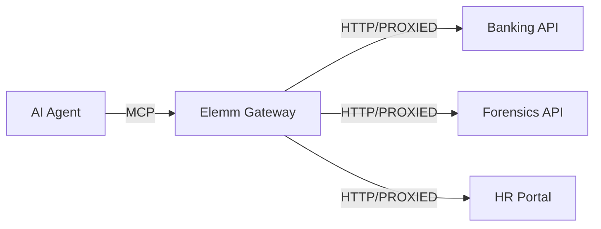

# Elemm Gateway: The Universal Protocol Broker

The Elemm Gateway is a specialized MCP server that acts as a centralized hub for distributed AI infrastructure. It enables an agent to connect to any Elemm-compliant API, discover its landmarks, and execute tools across different hosts with automated session management.

## Core Features

- **Universal Connectivity**: Connect to any site exposing the `elemm-manifest.md`.
- **Dynamic Tool Discovery**: Automatically parses the `json-elemm` block in manifests to register technical tool definitions JIT (Just-in-Time).
- **Auto-Auth Scoping**: Automatically captures `access_token` responses and securely injects them as `Authorization: Bearer ...` headers for subsequent calls to that specific host.
- **Protocol Passthrough**: Proxies core tools like `get_manifest`, `navigate`, and `execute_action` to the remote backend.

## Architecture: The Broker Model

Unlike a standard Elemm bridge which is bound to a single application (FastAPI or Native Python), the Gateway starts with an empty toolbelt (except for core protocol tools) and populates itself dynamically.



## Usage

### 1. Starting the Gateway

The Gateway is typically run as a standalone MCP server via Stdio:

```python
from elemm_gateway.server import ElemmGateway

if __name__ == "__main__":
    gateway = ElemmGateway(server_name="Solaris Central Hub")
    gateway.run()
```

### 2. Connecting to a Site

The agent initiates a connection using the `connect_to_site` tool.

**Agent Call:**
```json
{
  "name": "connect_to_site",
  "arguments": {
    "url": "https://api.banking.solar-ops.com"
  }
}
```

**What happens behind the scenes:**
1. The Gateway fetches `https://api.banking.solar-ops.com/.well-known/elemm-manifest.md?technical=true`.
2. It extracts the `AGENT DIRECTIVE` and the `json-elemm` technical block.
3. It registers all discovered tools in the current MCP session.
4. The agent is welcomed with the site's specific instructions.

## Automated Session Management (Scoped Auth)

One of the most critical tasks of the Gateway is managing credentials. If a tool call to `Site A` returns an `access_token`, the Gateway:
1. Extracts the token.
2. Maps it to the hostname of `Site A`.
3. Injects it into all future requests to `Site A`.
4. **Important**: Requests to `Site B` remain unaffected, preventing credential leakage across domains.

## Comparison: Bridge vs. Gateway

| Feature | Elemm Bridge (Standard) | Elemm Gateway |
| :--- | :--- | :--- |
| **Binding** | Hard-bound to one application (Python/FastAPI) | Dynamic (Connects via URL) |
| **Tool Source** | Local Python functions | Remote Manifests (.md) |
| **Discovery** | JIT via internal registry | HTTP fetching & Regex parsing |
| **Multi-Host** | No | Yes (Unified Hub) |
| **Auth** | Managed via ContextVars | Scoped Header Management |

## Best Practices

1. **Root Path Awareness**: Ensure your backends have `root_path` configured correctly if they are behind a reverse proxy, so the Gateway can find the `.well-known` endpoints.
2. **Technical Discovery**: Always enable `technical=true` support in your backends to allow the Gateway to see the underlying MCP definitions.
3. **Identity Chains**: In complex forensic scenarios (like the Solaris Gauntlet), use the Gateway to bridge the gap between "Identity Providers" (HR) and "Resource Servers" (Banking/IT).
