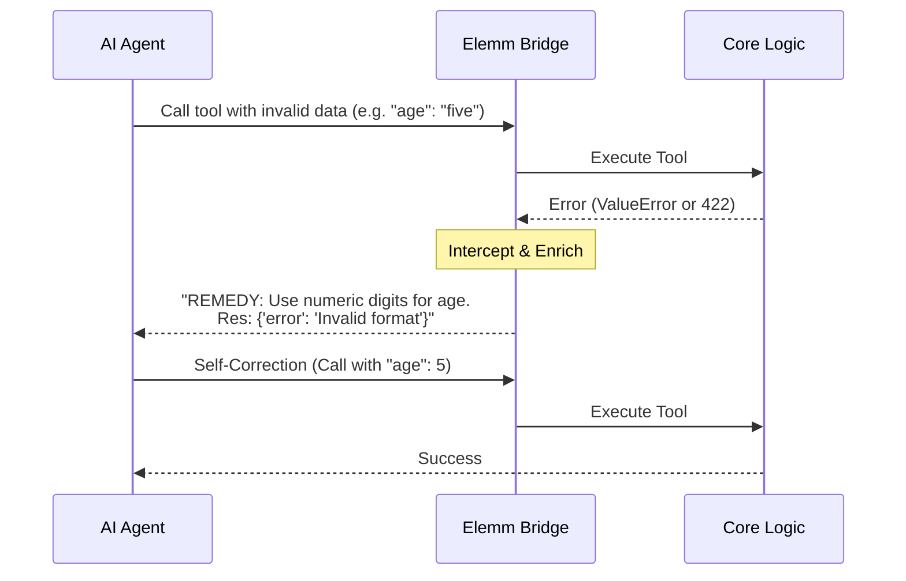

# Elemm Resilience: The Agent Repair Kit

AI agents are prone to failures such as typos, hallucinated parameters, or incorrect data types. Traditional APIs typically respond with raw technical errors (e.g., `422 Unprocessable Entity`), which often causes agents to "stall" or enter infinite loops of the same mistake.

The **Elemm Agent Repair Kit** solves this by providing **Self-Healing Infrastructure**. It intercepts errors and injects human-readable, action-oriented instructions back to the agent in real-time.

---

## 1. How It Works: The Semantic Loop

Instead of cluttering tool descriptions with every possible validation rule (which wastes expensive tokens), Elemm delivers instructions **Just-in-Time**—only when an error actually occurs.



---

## 2. Static vs. Dynamic Remedies

Elemm supports two levels of repair, depending on the complexity of your business rules.

### A. Static Remedies (via Decorator)
Used for constant rules that apply to every call of the tool.

```python
@ai.action(
    id="update_profile",
    remedy="Always use YYYY-MM-DD for dates. Do not use month names."
)
def update(birth_date: str):
    ...
```

### B. Dynamic Remedies (via In-Code Logic)
Used when the correction hint depends on the **actual input** provided by the agent.

#### Native Python: The `ActionError` Pattern
In pure Python environments, use the `ActionError` exception to signal specific recovery paths.

```python
from elemm.core.exceptions import ActionError

@manager.action(id="transfer_funds")
def transfer(amount: int, target_account: str):
    if amount > 5000:
        raise ActionError(
            message="Daily limit exceeded",
            remedy="For amounts > 5000, you must first call 'request_limit_increase()'."
        )
    if not target_account.startswith("IBAN"):
        raise ActionError(
            message="Invalid account",
            remedy="Target account must be a valid IBAN starting with 'IBAN'."
        )
```

#### FastAPI: The Response Pattern
In FastAPI, you can simply return a dictionary containing the `remedy` key, or raise a `HTTPException` which the Elemm middleware will enrich.

---

## 3. Automated Noise Detection

Agents often "hallucinate" parameters that do not exist in your API (e.g., adding `force=True` to a delete call because it "feels" right).

Elemm automatically identifies these:
1. It validates the incoming arguments against the **Landmark Manifest**.
2. If unexpected parameters are found, it injects a `noise_warning`.
3. **Agent Feedback:** `"The action does not support these parameters: ['force']. Stick strictly to the manifest parameters."`

---

## 4. The Response Structure

When the Repair Kit is triggered, the agent receives a multi-layered response designed to force correction:

1.  **REMEDY**: The primary instruction (What to do now).
2.  **NOTE**: Additional context (Why it failed).
3.  **Result**: The actual technical error from the backend.

**Example Agent Output:**
> **REMEDY**: Use numeric digits for the 'amount' field.  
> **NOTE**: The system rejected 'ten' as a non-integer value.  
> **Res [pay]**: {"error": "invalid literal for int()", "status": "error"}

---

## 5. Writing "Agent-Grade" Remedies

Good remedies are **imperative** and **unambiguous**.

| Context | Bad (Technical) | Good (Agent-Grade) |
| :--- | :--- | :--- |
| **Validation** | "Invalid ID" | "IDs must start with 'USR-' followed by 4 digits (e.g., USR-1234)." |
| **Workflow** | "Unauthorized" | "You lack permission. Navigate to 'explore_auth' and call 'get_token' first." |
| **Data Type** | "422: Unprocessable" | "Ensure the 'items' list contains at least one object with a 'sku' field." |

---

## 6. Summary: Zero-Shot Vision

The Repair Kit is the backbone of Elemm's **Zero-Shot Vision**. It allows you to build complex, enterprise-grade AI integrations without writing a single line of prompt engineering. The protocol itself guides the agent through the infrastructure, correcting its path every time it veers off course.
